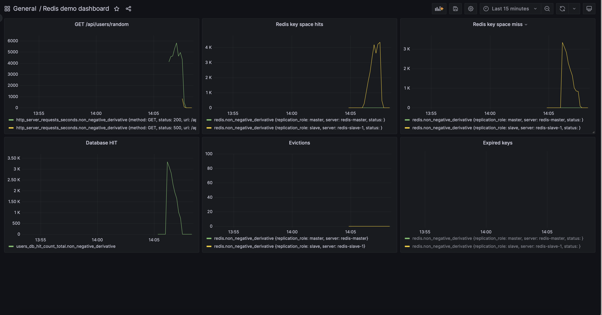
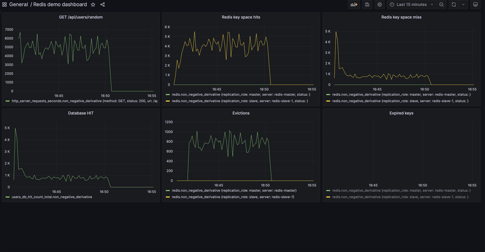
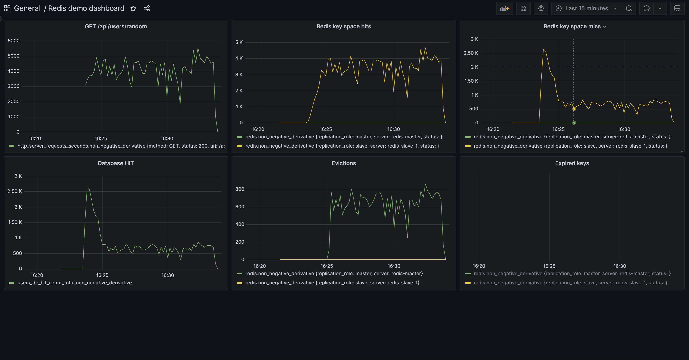
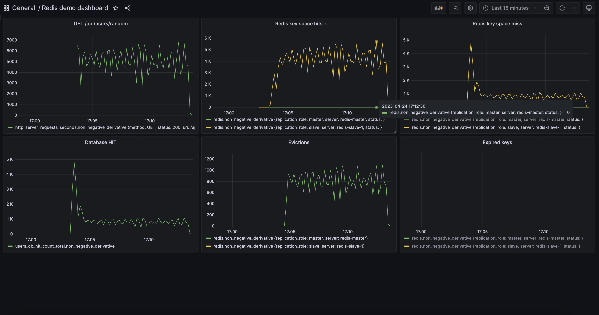
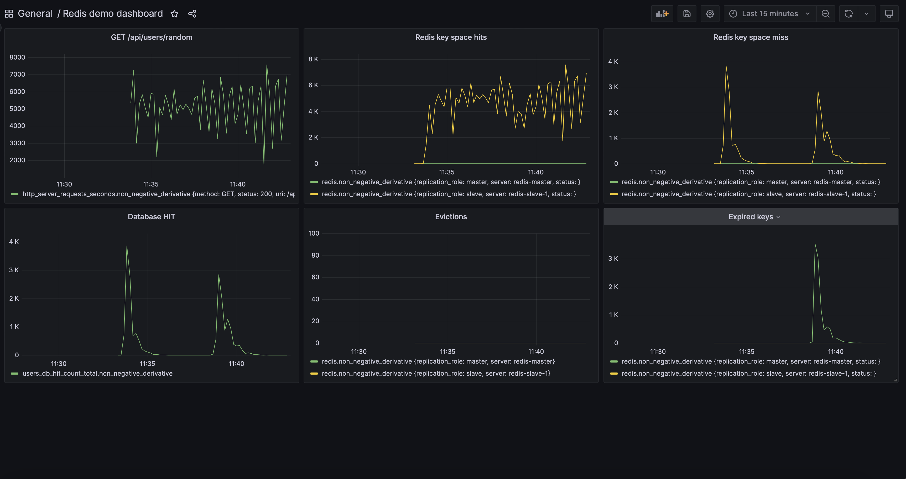
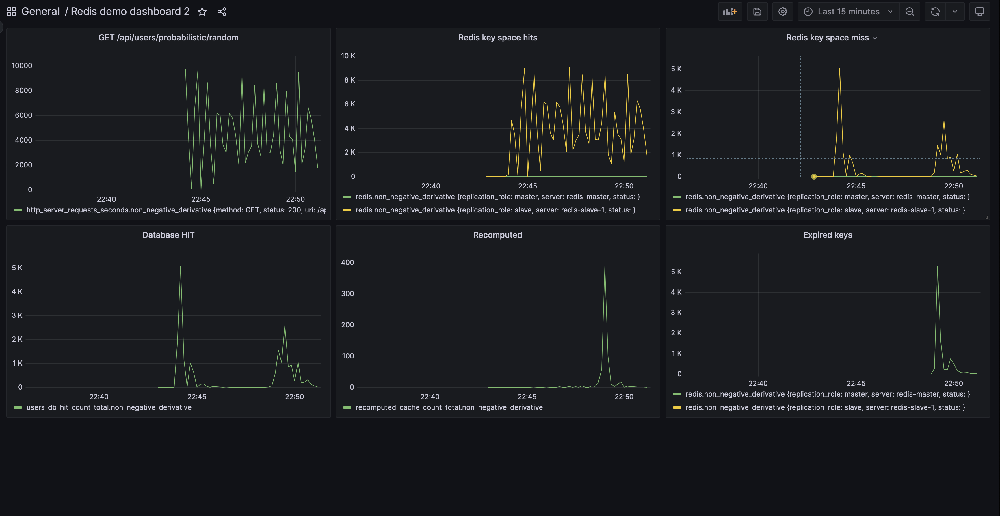

# Redis demo

The demo is written in Java/Spring Boot, and uses Redis cluster for caching.

The Redis cluster includes master, slave and sentinel nodes. Monitoring of Redis and service is done with a TIG stack.

## How to run

1. Configure Redis `--maxmemory` and `--maxmemory-policy` in `docker-compose.yaml` file;
2. Start up docker containers: ```docker-compose up -d```;

## Test conditionals
1. Conditionals for eviction policies test:

   |Name             |Result|
   |-----------------|-----:|
   |DB rows          |10000 |
   |Redis max memory |10 MB |
   |Cache TTL        |5 min |

   ```
   siege -d -c 10 -t 10m http://localhost:8080/api/users/random
   ```
   
2. Conditionals for probabilistic cache test:

   |Name             |Result|
   |-----------------|-----:|
   |DB rows          |10000 |
   |Redis max memory |200 MB|
   |Cache TTL        |5 min |

   ```
   siege -d -c 10 -t 10m http://localhost:8080/api/users/probabilistic/random
   ```

## Results

---
### Testing Redis with eviction policy set to noeviction
The ```noeviction``` policy disabled automatic eviction of keys when the memory limit is reached.

This caused OOM as soon as the cache was filled up to 10Mb: ```Request failed: OOM command not allowed when used memory > 'maxmemory'```.

|Name                   |Result           | 
|-----------------------|----------------:|
|Transactions           |42487 hits       |
|Availability           |97.64 %          |
|Elapsed time           |91.16 secs       |
|Data transferred       |4.43 MB          |
|Response time          |0.05 secs        |
|Transaction rate       |466.07 trans/sec |
|Throughput             |0.05 MB/sec      |
|Concurrency            |24.87            |
|Successful transactions|42487            |
|Failed transactions    |1028             |
|Longest transaction    |1.56             |
|Shortest transaction   |0.00             |



---

### Testing Redis with eviction policy set to allkeys-lru

The ```allkeys-lru``` policy evicts the least recently used keys when the memory limit is reached.

|Name                   |Result           | 
|-----------------------|----------------:|
|Transactions           |296515 hits      |
|Availability           |100.00 %         |
|Elapsed time           |600.16 secs      |
|Data transferred       |30.10 MB         |
|Response time          |0.05 secs        |
|Transaction rate       |494.06 trans/sec |
|Throughput             |0.05 MB/sec      |
|Concurrency            |24.86            |
|Successful transactions|296515           |
|Failed transactions    |0                |
|Longest transaction    |3.59             |
|Shortest transaction   |0.00             |



---

### Testing Redis with eviction policy set to allkeys-lfu

The ```allkeys-lfu``` policy evicts the least frequently used keys when the memory limit is reached.

|Name                   |Result           | 
|-----------------------|----------------:|
|Transactions           |246058 hits      |
|Availability           |100.00 %         |
|Elapsed time           |600.25 secs      |
|Data transferred       |24.98 MB         |
|Response time          |0.06 secs        |
|Transaction rate       |409.93 trans/sec |
|Throughput             |0.04 MB/sec      |
|Concurrency            |24.86            |
|Successful transactions|246058           |
|Failed transactions    |0                |
|Longest transaction    |1.96             |
|Shortest transaction   |0.00             |



---

### Testing Redis with eviction policy set to allkeys-random

The ```allkeys-random``` policy evicts random keys when the memory limit is reached.

|Name                   |Result           | 
|-----------------------|----------------:|
|Transactions           |306201 hits      |
|Availability           |100.00 %         |
|Elapsed time           |600.46 secs      |
|Data transferred       |31.08 MB         |
|Response time          |0.05 secs        |
|Transaction rate       |509.94 trans/sec |
|Throughput             |0.05 MB/sec      |
|Concurrency            |24.89            |
|Successful transactions|306201           |
|Failed transactions    |0                |
|Longest transaction    |4.18             |
|Shortest transaction   |0.00             |



---

### Testing Redis with cache TTL of 5 minutes without using probabilistic updates



### Testing Redis with cache TTL of 5 minutes using probabilistic updates


